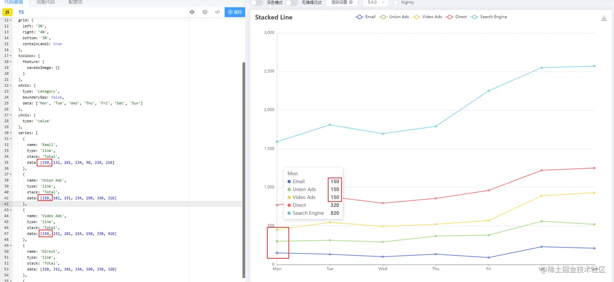
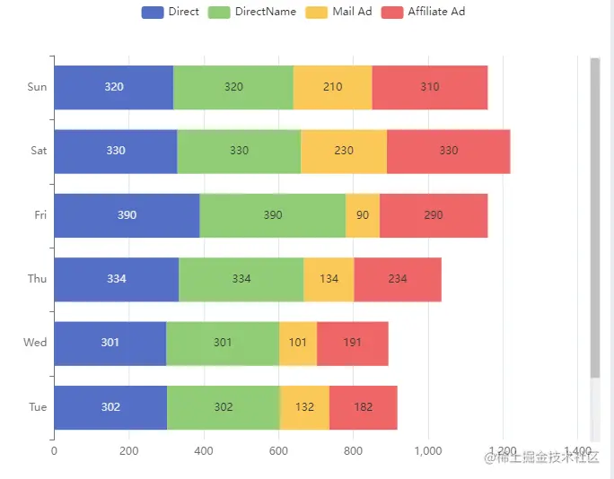
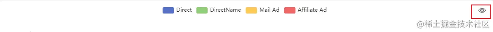

## ECharts 的基本使用

**① 安装 ECharts**

`npm install echarts --save`

**② 项目引入 ECharts**

`import * as echarts from 'echarts';`

**③ 准备图表的容器**

`<div class="columnChart"></div>`

**④ 初始化图表**

` const columnChart = echarts.init(document.querySelector('.columnChart'));`

**⑤ 图表数据更新**

- `let columnChart = echarts.getInstanceByDom( document.querySelector('.columnChart') );`
- ` let option = columnChart.getOption();`

* 调用接口赋值 `option`

## ECharts 相关问题记录

### Q1.ECharts 数据更新，但 x 轴或 y 轴显示未同步变化

**Answer:** 修改整个 `yAxis`或 `xAxis`,而不是对 `yAxis.data`或 `xAxis.data`进行赋值。

### Q2.堆叠折线图 series 的 data 值与图表展示不一致-如下图所示



**Answer:** 去掉` stack: 'Total'`。`stack`是堆叠属性，刻度反映的是累计之和。

echarts 官网补充：目前 `stack` 只支持堆叠于 `'value'` 和 `'log'` 类型的类目轴上，不支持 `'time'` 和 `'category'` 类型的类目轴。

### Q3.图表的图例去除点击功能

**Answer:** ` legend: {selectedMode: false},`

### Q4.echarts 图表绑定点击事件，会出现事件调用多次

**Answer:** 解绑点击事件
`columnChart.off('click');`

### Q5.图表的数据以千分符展示，或以别的形式展示

**Answer:** 通过`label.formatter`方法处理数据展示

```js
label: {
        show: true, // 是否展示
        position: 'inside', // 数据展示的位置
        formatter: (param) => {
          return param.value.toLocaleString();
        }
      },
```

### Q6.图表数据刷新时出现 tooltip 和数据展示不对应，或旧数据残留

**Answer:** `columnChart.setOption(columnChartOptions, { replaceMerge: ['series'] });`

此问题出现是因为 echarts 图表配置项和数据更新模式为普通合并，设置`replaceMerge`指定`series`组件类型，则该类型会由普通合并变为替换合并。普通合并和替换合并的区别[详见官网](https://echarts.apache.org/zh/api.html#echartsInstance.setOption)

### Q7.图表添加滚动条并修改滚动条样式

**Answer:** 滚动条样式示例-具体配置项说明[详见官网](https://echarts.apache.org/zh/option.html#dataZoom)

```js
    dataZoom: [
    {
      type: 'slider',
      show: true,
      yAxisIndex: [0],
      showDetail: false,
      left: '98%',
      minValueSpan: 5,
      maxValueSpan: 5,
      start: 100,
      width: 12,
      brushSelect: false,
      handleSize: '0px',
      handleIcon: 'none',
      moveHandleSize: 0,
      moveHandleIcon: 'none',
      backgroundColor: '#f1f1f1',
      fillerColor: '#c1c1c1',
      borderColor: '#f1f1f1'
    },
    {
      type: 'inside',
      yAxisIndex: [0]
    }
  ],
```



### Q8.图表添加点击放大事件

**Answer:** `option`添加`toolbox`--重写`onClick`事件--在弹窗中重新渲染图表



```
    toolbox: {
    feature: {
      myTool1: {
        show: true,
        icon: 'path://M432.45,595.444c0,2.177-4.661,6.82-11.305,6.82c-6.475,0-11.306-4.567-11.306-6.82s4.852-6.812,11.306-6.812C427.841,588.632,432.452,593.191,432.45,595.444L432.45,595.444z M421.155,589.876c-3.009,0-5.448,2.495-5.448,5.572s2.439,5.572,5.448,5.572c3.01,0,5.449-2.495,5.449-5.572C426.604,592.371,424.165,589.876,421.155,589.876L421.155,589.876z M421.146,591.891c-1.916,0-3.47,1.589-3.47,3.549c0,1.959,1.554,3.548,3.47,3.548s3.469-1.589,3.469-3.548C424.614,593.479,423.062,591.891,421.146,591.891L421.146,591.891zM421.146,591.891',
        onclick: function () {}
      }
    }
  },
```

重写 onClick 方法时，如想传入其它参数使用 bind，写法如下：

`option.toolbox[0].feature.myTool1.onclick = enlargeColumnChart.bind(this,'columnChart');`

### Q9.饼图中数据展示为百分比展示

**Answer:** `label: { position: 'inside',formatter: {d}%},`

### Q10.柱状堆叠图展示总数

处理思路：

- `series`新增系列，将此系列中的 data 数组中元素都赋值为 0，处理 label 数据展示

```js
{
      name: 'Total',
      type: 'bar',
      stack: 'total',
      label: {
        show: true,
        position: 'top',
        distance: -3,
        formatter: (params) => {
       // series[series.length - 1].data来自接口返回值，是total数据对应的数组
          return series[series.length - 1].data[
            params.dataIndex
          ].value.toLocaleString();
        }
      },
      emphasis: {
        focus: 'series'
      },
      data: [0, 0, 0, 0, 0, 0, 0]
    };
```

- 处理 legend，将总数对应的图例隐藏

```js
optionName.legend = {
  selectedMode: false,
  data: optionName.series.map((item) => {
    if (item.name !== 'Total') {
      return {
        name: item.name
      };
    }
  })
};
```
